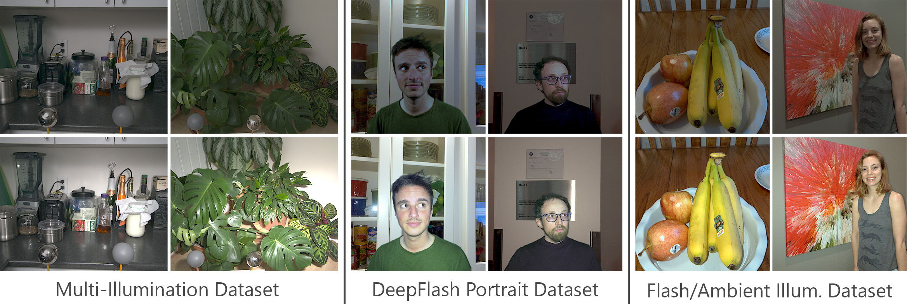

# Extended FAID Dataset


We address the challenge of obtaining large-scale datasets that are appropriate for training deep networks to perform flash-related tasks in real-world scenarios. Although several small-scale datasets have been suggested in prior studies, none of them offer sufficient data to generalize to images captured in natural settings. To overcome this limitation, we combine and extend three existing datasets: The Multi-Illumination Dataset (MID), The Flash and Ambient Illuminations Dataset (FAID), and the Deep Flash Portrait Dataset (DPD). We propose a method for harmonizing and compositing portrait images from DPD onto plausible backgrounds from FAID. Additionally, we explain our procedure for performing brightness normalization to ensure consistent illumination intensity across datasets. Finally, we discuss strategies for data augmentation, including randomization of backgrounds and ambient color temperature.

Project web page: http://yaksoy.github.io/intrinsicFlash

Dataset web page: http://yaksoy.github.io/efaid

# Dataset Preparation
Our dataset contains flash/no-flash pairs from [Flash and Ambient Illuminations Dataset
](http://yaksoy.github.io/faid/), [Dataset of Multi-Illumination Images in the Wild
](https://projects.csail.mit.edu/illumination/) and [DeepFlash](http://graphics.unibas.it/www/flash_no_flash/index.md.html).
## Flash and Ambient Illuminations Dataset
Download all the illuminations from the main dataset in the link and extract them into a single folder called 'Illuminations'. 

Download and extract the exif files.

Use the [IluminationsToXYZ](./IluminationsToXYZ.m/) script to map the illuminations to XYZ color space with the color matrix available in exif data of the PNG files. 

Use the [FAID](./FAID.py/) script to convert the illuminations to linear RGB and white balance them. 

## Multi-Illumination Dataset

Download the multi illumination dataset through the link. 
 

Use the [MID](./MID.py/) script to convert the illuminations to linear RGB, white balance them and put the different ambient illuminations for each scene in different sub-folders.

## DeepFlash Portrait Dataset

Please contact the authors to get access to the preprocessed dataset. The preprocessing has an affine aligement between flash and no-flash photos. 

We utilize flash photographs in 'inputs_origin' and no-flash photographs in 'target' folders.

Each portrait is rotated from 10 different angles, we only select one of the angles for each photoghraph.

We segment and generate the alpha mattings for the flash and no-flash pairs. Download the alpha mats [here](https://vault.sfu.ca/index.php/s/wdRHtP6qqXQ5gOn). 

We select photographs from the FAID that are suitable to use as background images. Download them [here](https://vault.sfu.ca/index.php/s/U8Hm9Q83A45ZQ0g).

Utilize the [DPD](./DPD.py/) script to blend the portraits with background images, white balance them and save the linear RGB images in sub-folders based on the number of different backgrounds chosen for each portrait.  


## Citation
This implementation is provided for academic use only. Please cite our accompanying paper as well as associated papers for the 3 datasets if you use this dataset in your research. 
```
@INPROCEEDINGS{maralan2023flash,
  author={Sepideh Sarajian Maralan and Chris Careaga and Ya\u{g}{\i}z Aksoy},
  title={Computational Flash Photography through Intrinsics},
  journal={Proc. CVPR},
  year={2023}
}
```


```
@INPROCEEDINGS{flashambient,
  author={Ya\u{g}{\i}z Aksoy and Changil Kim and Petr Kellnhofer and Sylvain Paris and Mohamed Elgharib and Marc Pollefeys and Wojciech Matusik},
  booktitle={Proc. ECCV},
  title={A Dataset of Flash and Ambient Illumination Pairs from the Crowd},
  year={2018},
}
```

```
@inproceedings{murmann19,
  author={Lukas Murmann and Michael Gharbi and Miika Aittala and Fredo Durand},
  booktitle={2019 IEEE International Conference on Computer Vision (ICCV)},
  title={A Multi-Illumination Dataset of Indoor Object Appearance},
  year={2019},
}
```

```
@article{CAPECE201928,
	title	 =	"Deep{F}lash: Turning a flash selfie into a studio portrait",
	journal	 =	"Signal Processing: Image Communication",
	volume 	 =	"77",
	pages 	 =	"28 - 39",
	year 	 = 	"2019",
	issn 	 = 	"0923-5965",
	doi 	 = 	"https://doi.org/10.1016/j.image.2019.05.013",
	url 	 = 	"http://www.sciencedirect.com/science/article/pii/S0923596519300451",
	author 	 = 	"Nicola Capece and Francesco Banterle and Paolo Cignoni and Fabio Ganovelli and Roberto Scopigno and Ugo Erra",
	keywords = "Image enhancement, Machine learning algorithms, Deep learning, Computational photography, Image processing",
}
```

